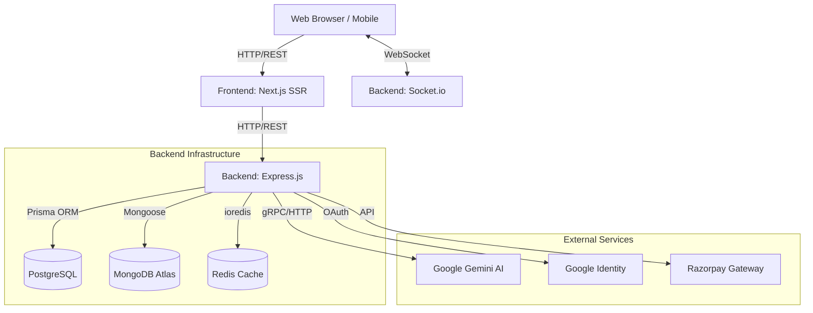

# High-Level Design (HLD)

## 1. System Overview
FinSense is a full-stack, cloud-native application employing a microservices-inspired client-server architecture. It isolates the presentation layer (Frontend) from the business logic and AI orchestration layer (Backend), enabling independent scaling and distinct separation of concerns.

## 2. Architecture Diagram

## 3. Technology Stack
* **Frontend:** Next.js (React 18), Tailwind CSS, Axios.
* **Backend:** Node.js, Express.js.
* **Relational Database (Core Data):** PostgreSQL (managed via Prisma ORM). Used for strictly structured financial data (Users, Transactions, Categories, LLM Usage Logs).
* **NoSQL Database (Context Data):** MongoDB. Used for unstructured chat histories and high-dimensional vector embeddings (RAG context).
* **Caching:** Redis. Minimizes database reads for heavy computational queries like the Dashboard Summary.
* **AI Provider:** Google Gemini API (utilized for chat, structured JSON data extraction, and semantic embeddings).

## 4. Component Interactions & Data Flow

### 4.1. Standard Request Flow (e.g., Fetching Dashboard)
1. **Client Request:** The user navigates to the dashboard. The Next.js frontend makes a `GET /api/transactions/summary` request.
2. **Rate Limiting & Auth:** The Express router intercepts the request, runs the rate-limiter, and verifies the JWT.
3. **Cache Check:** The backend queries Redis for the key `summary:<userId>`.
   - **Cache Hit:** Data is returned instantly.
   - **Cache Miss:** The backend queries PostgreSQL via Prisma, computes the summary, stores it in Redis for 60 seconds, and returns it to the user.

### 4.2. AI Chat Flow (Tool Calling & SSE)
1. **Prompt Submission:** The user asks, "Add $50 for groceries."
2. **Context Gathering:** The backend fetches the last 20 chat messages from MongoDB and the last 50 transactions from Postgres.
3. **LLM Invocation:** The backend streams the prompt and context to the Gemini API, alongside a registry of available "Tools" (functions).
4. **Tool Execution:** Gemini halts and requests the execution of the `create_transaction` tool. The Express backend executes the Prisma query, saving the $50 transaction to Postgres.
5. **Real-time Sync:** The backend fires a WebSocket event (`transaction_added`), immediately updating the user's dashboard UI.
6. **Streaming Response:** Gemini streams the final text response back to the Express server, which pipes the stream directly to the Next.js frontend via Server-Sent Events (SSE).

### 4.3. Automated Cron Flow
1. **Trigger:** `node-cron` fires a trigger daily at 08:00 server time.
2. **Aggregation:** The cron service loops over all users, pulling transactions from the last 24 hours.
3. **Document Creation:** A statistical digest is computed and saved as a document in MongoDB.

## 5. Security & Deployment Architecture
* **Containerization:** Both the frontend and backend possess multi-stage Dockerfiles. A root `docker-compose.yml` orchestrates the local topology, linking the backend to Postgres and Redis containers.
* **Cloud Toplogy:**
  * **Frontend:** Vercel (Edge Network for optimized SSR).
  * **Backend:** Render/Railway (Containerized Web Service to support persistent WebSocket connections).
  * **Databases:** Neon/Supabase (PostgreSQL) and MongoDB Atlas.
* **Secret Management:** `.env` files are excluded from version control. All critical configurations are injected at runtime via the hosting platform's environment variable vaults.
