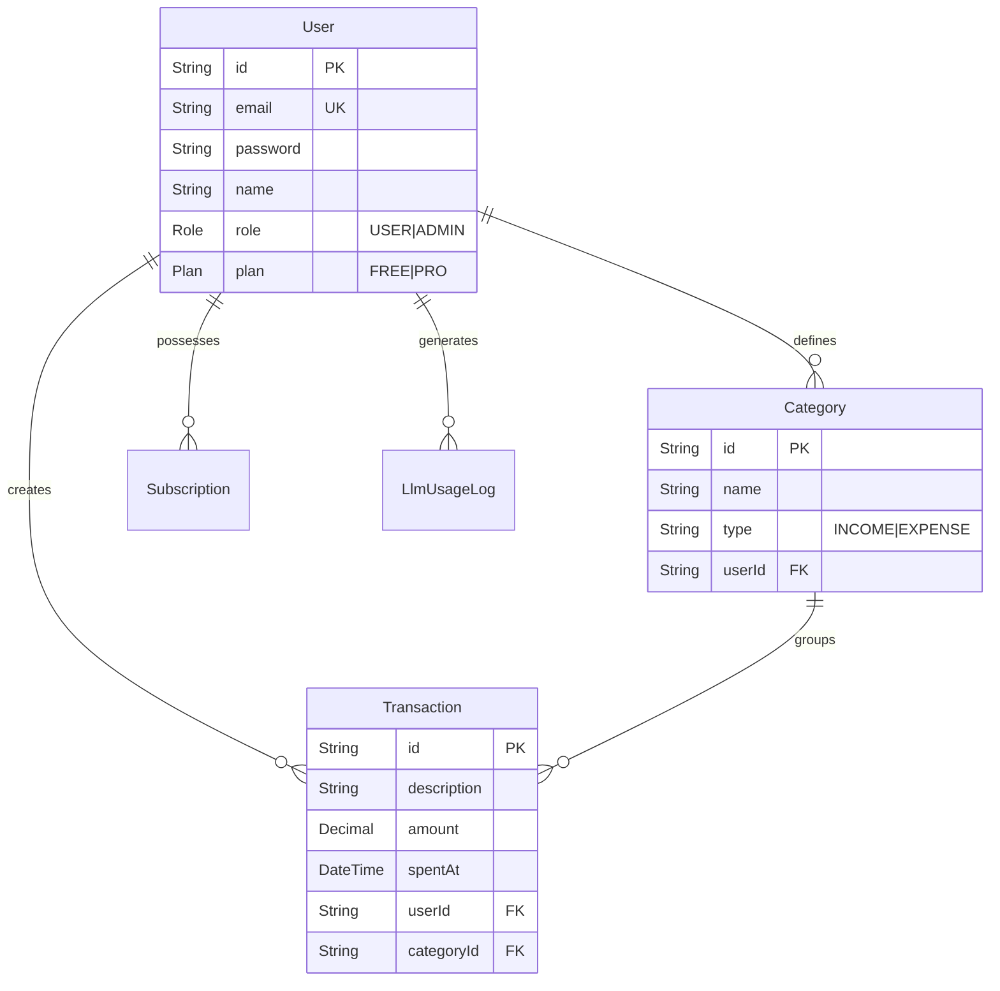
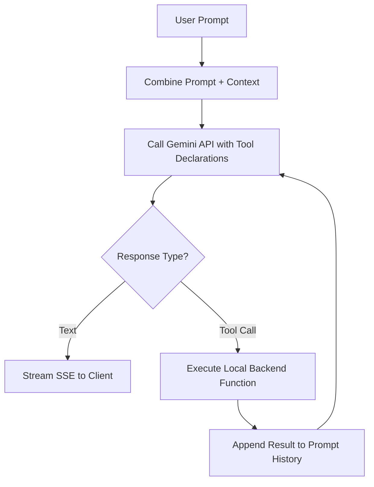

# Low-Level Design (LLD)

## 1. Database Schema Design

### 1.1 PostgreSQL (Relational Data)
Managed via Prisma. Designed for strict relational integrity.

### 1.2 MongoDB (NoSQL / Vector Data)
Managed via Mongoose. Designed for unstructured logs and high-dimensional vector embeddings.

* **ChatMessage Schema:** `{ userId: String, role: "user|assistant", content: String, starred: Boolean, createdAt: Date }`
* **TransactionEmbedding Schema:** `{ userId: String, transactionId: String, text: String, embedding: [Number] }`
* **Digest Schema:** `{ userId: String, periodLabel: String, totalSpent: Number, topCategory: String, categoryBreakdown: Map }`

## 2. API Contract Design (RESTful)

### Auth & User (`/api/auth`)
* `POST /signup`: Expects `{ email, password, name }`. Returns `{ token, user }`.
* `POST /login`: Expects `{ email, password }`. Returns `{ token, user }`.
* `POST /google`: Expects `{ credential }` (Google ID Token). Returns `{ token, user }`.

### Transactions (`/api/transactions`)
* `GET /`: Supports query params `?month=YYYY-MM`, `?categoryId=ID`, `?sortBy=amount|spentAt`. Returns `[Transaction]`.
* `GET /summary`: Returns `{ totalIncome, totalExpense, balance }`. Caches result in Redis.
* `POST /`: Expects `{ description, amount, categoryId, spentAt }`. Flushes Redis cache. Emits `transaction_added` via WebSocket.
* `POST /ai-log`: Expects `{ text }`. Pipes to Gemini to extract JSON ` { description, amount }`, then creates transaction.

### AI Chat & Agent (`/api/chat`)
* `GET /history`: Retrieves last 100 `ChatMessage` documents from Mongo.
* `POST /`: SSE Stream endpoint. Expects `{ question }`. Returns streaming text chunks `data: {"token": "hello"}\n\n`.
* `POST /agent`: Invokes the Budget Health Agent. Returns the multi-step trace and final recommendation.

## 3. Core Algorithms & Logic

### 3.1 Caching Strategy
1. **Key Pattern:** `cache:<entity>:<userId>` (e.g., `cache:summary:usr_123`).
2. **Read-Through:** All summary endpoints attempt `redis.get(key)`. If null, query Prisma, then `redis.set(key, data, 'EX', 60)`.
3. **Write-Invalidation:** Any successful `POST`, `PUT`, or `DELETE` to `/api/transactions` invokes `redis.del(key)` to prevent stale data.

### 3.2 AI Tool Calling Loop (Chat)

### 3.3 Multi-Step Budget Agent Loop
1. Initialize `stepCount = 0`, `MAX_STEPS = 5`.
2. Append user prompt: "Analyze my budget."
3. **Loop Start:** Call LLM.
4. If LLM outputs text, loop breaks and returns final answer.
5. If LLM requests a tool (e.g., `get_monthly_spending`), execute tool, append result to history, `stepCount++`.
6. If `stepCount >= MAX_STEPS`, force termination and return "Agent reached step limit."

### 3.4 Retrieval-Augmented Generation (RAG)
When the user asks a specific question (e.g., "Where did I buy coffee?"):
1. The backend embeds the user's question into a 768-dimensional vector using `gemini-embedding-2`.
2. The backend queries MongoDB `TransactionEmbedding` for the user's documents.
3. A custom Node.js cosine similarity algorithm ranks the documents against the question vector.
4. The top 5 matched transaction strings are injected into the Gemini context prompt.
